# HW 2
## 4.1
- 4) 
  - a) Starting from L:  

| L   | a          | b           | c           | d           | e           | f           | g           | h           | i           | j           | k           | l           | m           | W           |
| --- | ---------- | ----------- | ----------- | ----------- | ----------- | ----------- | ----------- | ----------- | ----------- | ----------- | ----------- | ----------- | ----------- | ----------- |
| 0   | **(7, L)** | (14, L)     | (11, L)     | $\infty$    | $\infty$    | $\infty$    | $\infty$    | $\infty$    | $\infty$    | $\infty$    | $\infty$    | $\infty$    | $\infty$    | $\infty$    |
| 0   | **(7, L)** | (14, L)     | **(11, L)** | $\infty$    | $\infty$    | $\infty$    | $\infty$    | $\infty$    | $\infty$    | $\infty$    | $\infty$    | $\infty$    | $\infty$    | $\infty$    |
| 0   | **(7, L)** | **(14, L)** | **(11, L)** | (16, c)     | (27, c)     | $\infty$    | $\infty$    | $\infty$    | $\infty$    | $\infty$    | $\infty$    | $\infty$    | $\infty$    | $\infty$    |
| 0   | **(7, L)** | **(14, L)** | **(11, L)** | **(16, c)** | (23, d)     | (27, d)     | $\infty$    | (25, h)     | $\infty$    | $\infty$    | $\infty$    | $\infty$    | $\infty$    | $\infty$    |
| 0   | **(7, L)** | **(14, L)** | **(11, L)** | **(16, c)** | **(23, d)** | (27, d)     | (41, e)     | (25, b)     | $\infty$    | $\infty$    | $\infty$    | $\infty$    | $\infty$    | $\infty$    |
| 0   | **(7, L)** | **(14, L)** | **(11, L)** | **(16, c)** | **(23, d)** | (27, d)     | (41, e)     | **(25, b)** | $\infty$    | $\infty$    | $\infty$    | $\infty$    | $\infty$    | $\infty$    |
| 0   | **(7, L)** | **(14, L)** | **(11, L)** | **(16, c)** | **(23, d)** | **(27, d)** | (41, e)     | **(25, b)** | $\infty$    | (37, h)     | $\infty$    | $\infty$    | $\infty$    | $\infty$    |
| 0   | **(7, L)** | **(14, L)** | **(11, L)** | **(16, c)** | **(23, d)** | **(27, d)** | (34, f)     | **(25, b)** | (43, f)     | (37, h)     | $\infty$    | $\infty$    | $\infty$    | $\infty$    |
| 0   | **(7, L)** | **(14, L)** | **(11, L)** | **(16, c)** | **(23, d)** | **(27, d)** | **(34, f)** | **(25, b)** | (43, f)     | (37, h)     | (46, g)     | $\infty$    | $\infty$    | $\infty$    |
| 0   | **(7, L)** | **(14, L)** | **(11, L)** | **(16, c)** | **(23, d)** | **(27, d)** | **(34, f)** | **(25, b)** | (43, f)     | **(37, h)** | (46, g)     | $\infty$    | (52, j)     | $\infty$    |
| 0   | **(7, L)** | **(14, L)** | **(11, L)** | **(16, c)** | **(23, d)** | **(27, d)** | **(34, f)** | **(25, b)** | **(43, f)** | **(37, h)** | (46, g)     | (52, i)     | (52, j)     | $\infty$    |
| 0   | **(7, L)** | **(14, L)** | **(11, L)** | **(16, c)** | **(23, d)** | **(27, d)** | **(34, f)** | **(25, b)** | **(43, f)** | **(37, h)** | **(46, g)** | (54, i)     | **(52, j)** | (57, k)     |
| 0   | **(7, L)** | **(14, L)** | **(11, L)** | **(16, c)** | **(23, d)** | **(27, d)** | **(34, f)** | **(25, b)** | **(43, f)** | **(37, h)** | **(46, g)** | **(54, i)** | **(52, j)** | (57, k)     |
| 0   | **(7, L)** | **(14, L)** | **(11, L)** | **(16, c)** | **(23, d)** | **(27, d)** | **(34, f)** | **(25, b)** | **(43, f)** | **(37, h)** | **(46, g)** | **(54, i)** | **(52, j)** | **(57, k)** |

$L->c->d->f->g->k->W$  
- b)  
      - Starting from f:  
      do the same thing as above  
      the shortest path from f to L is $f->d->c->L$ with 27 roughness and to W is $f->g->k->W$ with 30 roughness.  
      - Starting from i:  
      do the same thing as above  
      the shortest path from i to L is $i->f->d->c->L$ with 43 roughness and to W is $i->k->W$ with 20 roughness.  
      - combine these together, we can get that $27+20 < 43 + 30$, thus the shortest path is $L->c->d->f->i->k->w$ with total roughness $27+16+20=63$

- 9)  
  For a complete graph with three nodes, say a, b and c. The distance are 1, 2, 
and -999 seperatly for ab, ac, and bc. start from node a, we find the distance
of ab and ac are 1 and 2, so we select b and add it to the visited node set. 
However, the actual shortest path from a to b is $a -> c -> b$ with total cost -997.  

## 4.2
- 2)  
  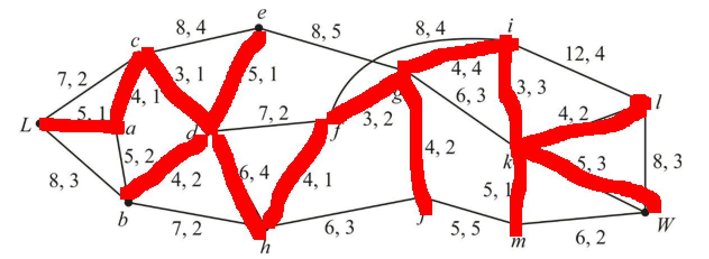  
    total cost of 59
  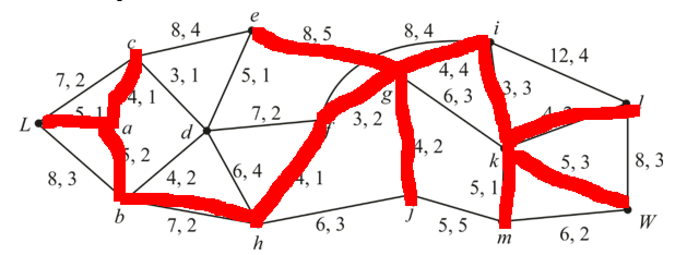  
  total cost of 61
  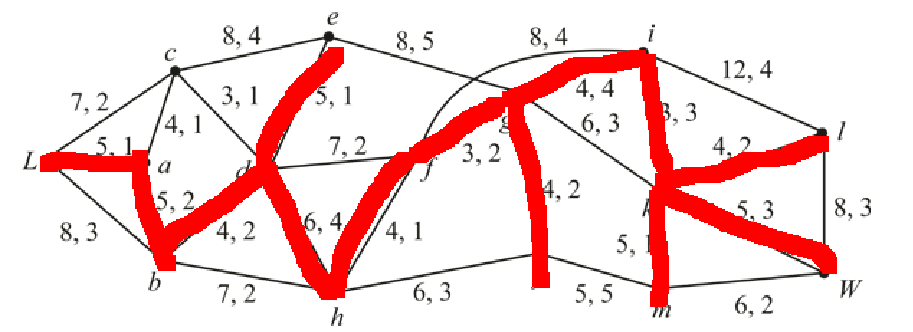  
  **total cost of 57**
- 5) 
  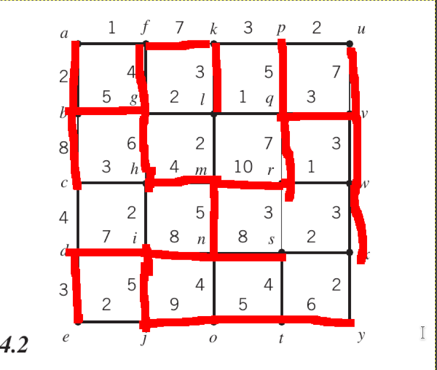  
  by times -1 with all of the costs and find the MST.

## 4.3
- 2) 
  - a)  
  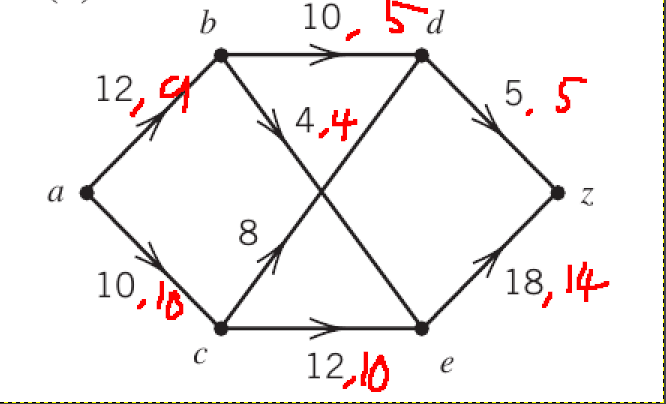  
  - b)  
  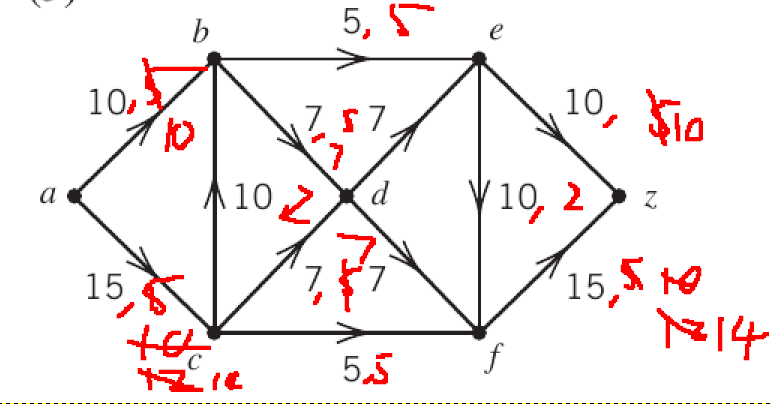  
- 3)  
  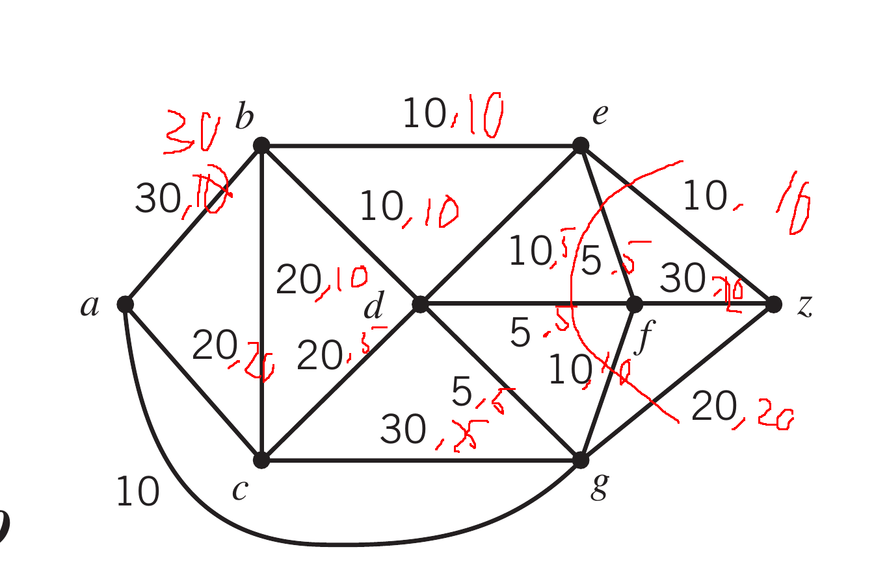  
- 6)  
  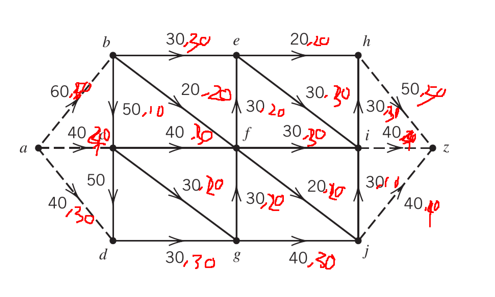  
- 8)  
  - a)  
  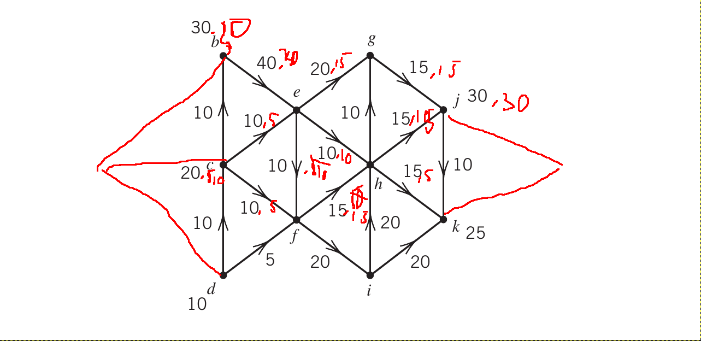  
  impossible
  - b)  
  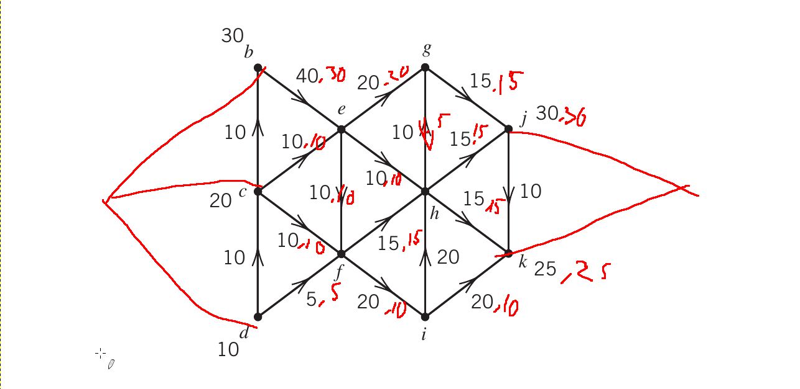  
  possible  
- 9)  
  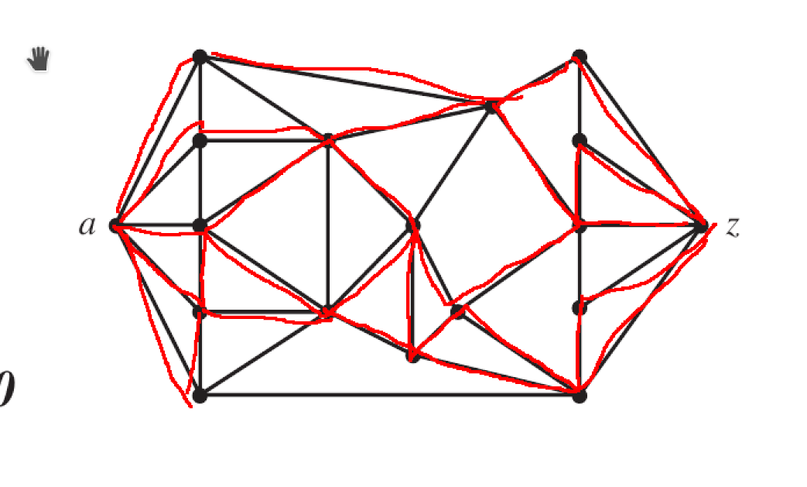  
  5 different ways.  
- 12)  
  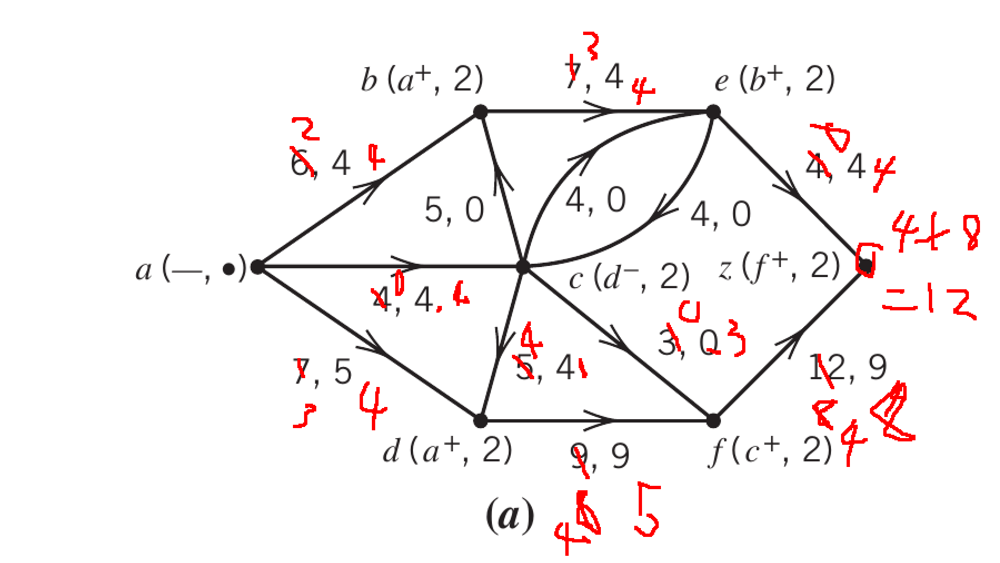  
- 21)  
  because it start from a, then a's child is marked with a$^+$ and the child of child marked child$^+$ which is exacly as the same as a tree and a is the root.
## 4.4
- 2)  
  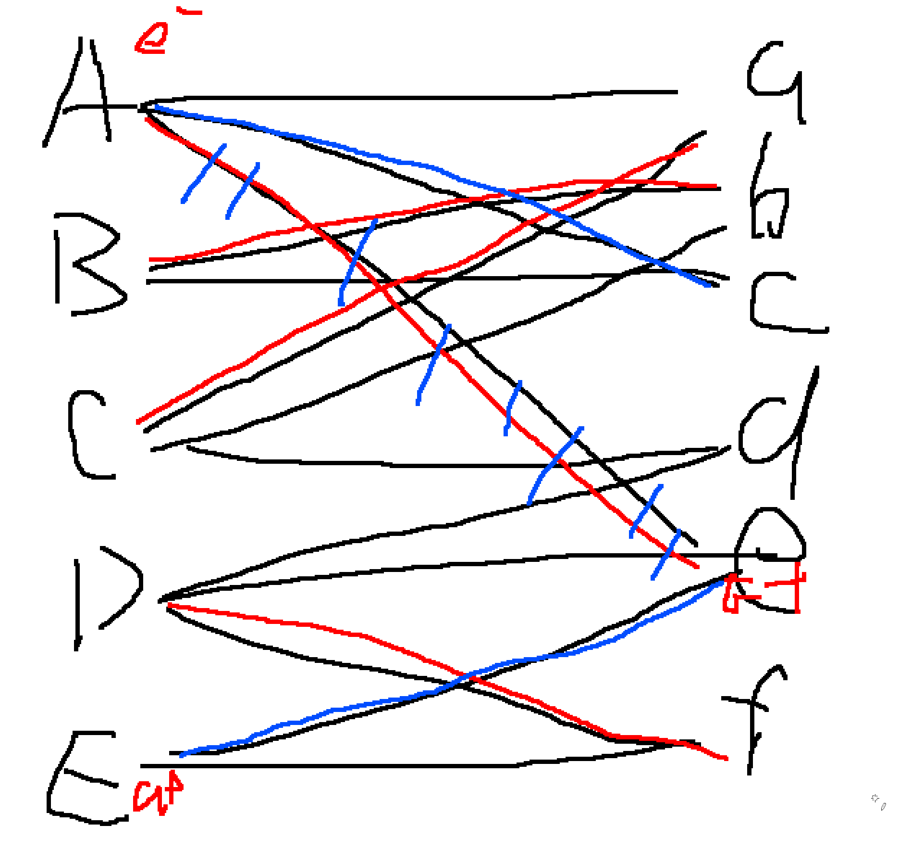  
- 4)  
  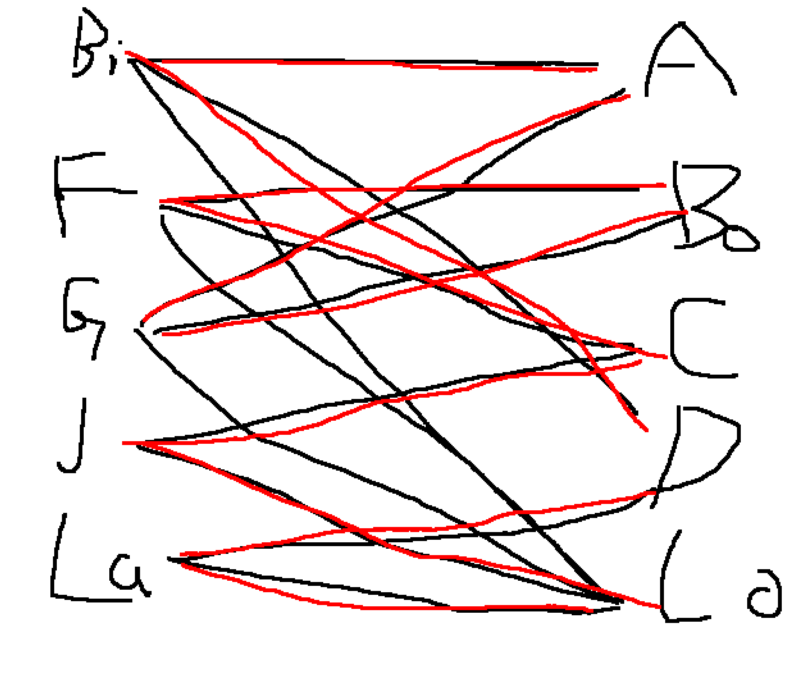  
- 5)  
impossible, at least 1 college want 7 Ph.D.s but there is only 6 universities.
- 8)  
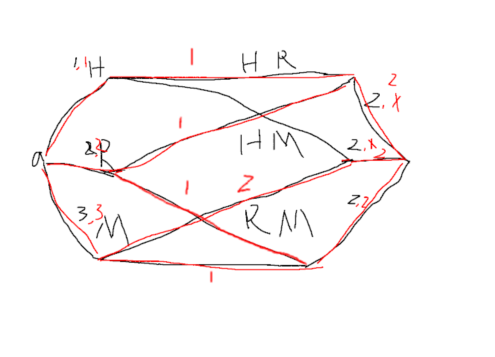  

## 4.5
- 4)
  - a)  
  North-West:  

  |     | 1   | 2   | 3   |     |
  | --- | --- | --- | --- | --- |
  | 1   | 30  |     |     | 30  |
  | 2   | 10  | 20  |     | 30  |
  | 3   |     | 20  | 10  | 30  |
  |     | 40  | 40  | 10  |     |

  |       | v1:5   | v2:1 | v3:-7 |     |
  | ----- | ------ | ---- | ----- | --- |
  | u1:0  | 5      | 2(1) | 0(-7) | 30  |
  | u2:-4 | 9      | 5    | 0(-3) | 30  |
  | u3:-7 | 4(12)+ | 8    | 0     | 30  |
  |       | 40     | 40   | 10    |     |

  |     | 1   | 2   | 3   |     |
  | --- | --- | --- | --- | --- |
  | 1   | 10  | 20  |     | 30  |
  | 2   | 10  | 20  |     | 30  |
  | 3   | 20  |     | 10  | 30  |
  |     | 40  | 40  | 10  |     |

  |       | v1:5 | v2:2  | v3:1 |     |
  | ----- | ---- | ----- | ---- | --- |
  | u1:0  | 5    | 2     | 0(1) | 30  |
  | u2:-4 | 9    | 5(6)+ | 0(5) | 30  |
  | u3:1  | 4    | 8(1)  | 0    | 30  |
  |       | 40   | 40    | 10   |     |

  |     | 1   | 2   | 3   |     |
  | --- | --- | --- | --- | --- |
  | 1   | 20  | 10  |     | 30  |
  | 2   |     | 30  |     | 30  |
  | 3   | 20  |     | 10  | 30  |
  |     | 40  | 40  | 10  |     |

  |       | v1:5 | v2:2 | v3:1  |     |
  | ----- | ---- | ---- | ----- | --- |
  | u1:0  | 5    | 2    | 0(1)+ | 30  |
  | u2:-3 | 9(8) | 5    | 0(4)  | 30  |
  | u3:1  | 4    | 8(1) | 0     | 30  |
  |       | 40   | 40   | 10    |     |

  |     | 1   | 2   | 3   |     |
  | --- | --- | --- | --- | --- |
  | 1   | 10  | 10  | 10  | 30  |
  | 2   |     | 30  |     | 30  |
  | 3   | 30  |     |     | 30  |
  |     | 40  | 40  | 10  |     |

  |       | v1:5 | v2:2 | v3:0  |     |
  | ----- | ---- | ---- | ----- | --- |
  | u1:0  | 5    | 2    | 0     | 30  |
  | u2:-3 | 9(8) | 5    | 0(3)+ | 30  |
  | u3:1  | 4    | 8(1) | 0(-1) | 30  |
  |       | 40   | 40   | 10    |     |

  |     | 1   | 2   | 3   |     |
  | --- | --- | --- | --- | --- |
  | 1   | 10  | 20  |     | 30  |
  | 2   |     | 20  | 10  | 30  |
  | 3   | 30  |     |     | 30  |
  |     | 40  | 40  | 10  |     |

  |       | v1:5 | v2:2 | v3:-3 |     |
  | ----- | ---- | ---- | ----- | --- |
  | u1:0  | 5    | 2    | 0(-3) | 30  |
  | u2:-3 | 9(8) | 5    | 0     | 30  |
  | u3:1  | 4    | 8(1) | 0(-4) | 30  |
  |       | 40   | 40   | 10    |     |

  optimized
- 6)
  - a)  
  North-West:  

  |     | 1   | 2   | 3   | 4   |     |
  | --- | --- | --- | --- | --- | --- |
  | 1   | 40  |     |     |     | 40  |
  | 2   | 10  | 10  | 10  |     | 30  |
  | 3   |     |     | 30  |     | 50  |
  |     | 50  | 10  | 40  | 20  |     |

  optimize:  

  |     | 1   | 2   | 3   | 4   |     |
  | --- | --- | --- | --- | --- | --- |
  | 1   |     | 10  | 30  |     | 40  |
  | 2   | 20  |     | 10  |     | 30  |
  | 3   | 30  |     |     | 20  | 50  |
  |     | 50  | 10  | 40  | 20  |     |

  |      | v1:4 | v2:2 | v3:5  | v4:1 |     |
  | ---- | ---- | ---- | ----- | ---- | --- |
  | u1:0 | 7(4) | 2    | 5     | 0(1) | 40  |
  | u2:1 | 3    | 5(1) | 4     | 0    | 30  |
  | u3:1 | 4(3) | 6(1) | 3(4)+ | 0    | 50  |
  |      | 50   | 10   | 40    | 20   |     |

  |     | 1   | 2   | 3   | 4   |     |
  | --- | --- | --- | --- | --- | --- |
  | 1   |     | 10  | 30  |     | 40  |
  | 2   | 30  |     |     |     | 30  |
  | 3   | 20  |     | 10  | 20  | 50  |
  |     | 50  | 10  | 40  | 20  |     |

  |      | v1:6 | v2:2  | v3:5 | v4:2  |     |
  | ---- | ---- | ----- | ---- | ----- | --- |
  | u1:0 | 7(4) | 2     | 5    | 0(2)+ | 40  |
  | u2:3 | 3    | 5(-1) | 4(2) | 0(-1) | 30  |
  | u3:2 | 4    | 6(0)  | 3    | 0     | 50  |
  |      | 50   | 10    | 40   | 20    |     |

  |     | 1   | 2   | 3   | 4   |     |
  | --- | --- | --- | --- | --- | --- |
  | 1   |     | 10  | 10  | 20  | 40  |
  | 2   | 30  |     |     |     | 30  |
  | 3   | 20  |     | 30  |     | 50  |
  |     | 50  | 10  | 40  | 20  |     |

  |      | v1:6 | v2:2  | v3:5 | v4:0  |     |
  | ---- | ---- | ----- | ---- | ----- | --- |
  | u1:0 | 7(6) | 2     | 5    | 0     | 40  |
  | u2:3 | 3    | 5(-1) | 4(2) | 0(-3) | 30  |
  | u3:2 | 4    | 6(0)  | 3    | 0(-2) | 50  |
  |      | 50   | 10    | 40   | 20    |     |  
  
  optimized