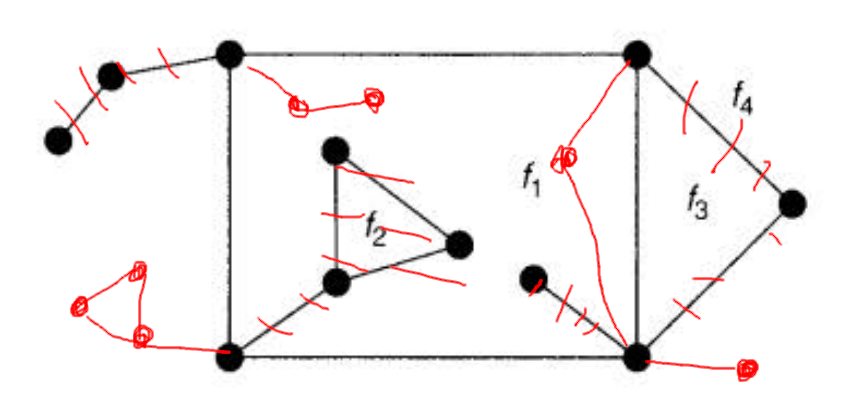
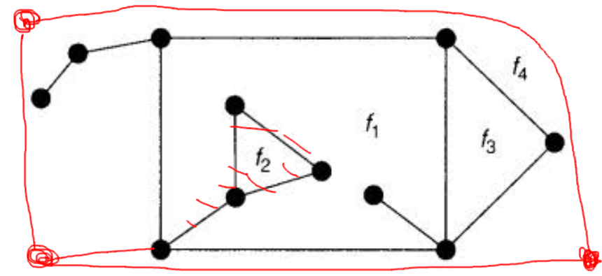
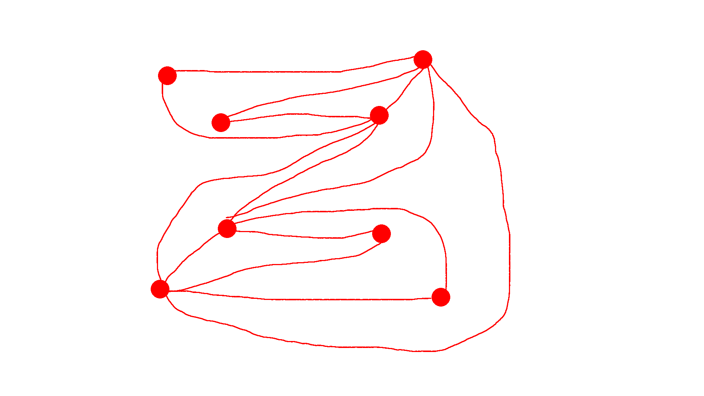

# HW5
## Chapter 4

 - 5. 2. It cannot contain a $K_5$ because there is only three sets of vertices and each of the sets is an independent set. By ingnoring the connection between, any two of r, s, t can be combined together to form a bipartite graph. Let's set V(n) to be the number of vertices inside a set n, then in order to avoid $K_{3,3}$, the equation below must be satisfied. $MIN(MAX(V(r), V(s), V(t)), (SUM(V(r), V(s), V(t))-MAX(V(r), V(s), V(t))))<3$
 - 8. 1. $K_5$ with one extra edge between any two vertices.
      2. It contains a *subgraph* of $K_5$
 - 10.  1. The only way to draw $K_4$ in planar is bounded by a circle of 3. And the only way to draw $K_{2,3}$ is a circle of even number. Since the outer bound does *NOT* match with the number of nodes, it must not be outerplanar.
        2. A graph homeomorphic or contradictable to $K_4$ or $K_{2,3}$ is non-outerplanar because we can find a set of nodes and paths between them form a $K_4$ or $K_{2,3}$ by igoring the extra nodes between two nodes. Similarly, for graph contains $K_4$ or $K_{2,3}$, we can ignore the extra nodes/edges that is not belong to $K_4$ or $K_{2,3}$. Thus, we can get a graph of $K_4$ or $K_{2,3}$. As we proved that $K_4$ or $K_{2,3}$ is non-outerplanar, the graph contains a subgraph of homeomorphic or contradictable to $K_4$ or $K_{2,3}$ is non-outerplanar.
 - 13.  1. 
        |   Graph   |   n   |   m   |   f   |
        | :-------: | :---: | :---: | :---: |
        |   $W_8$   |   8   |  14   |   8   |
        |     O     |   6   |  12   |   8   |
        |   4-13    |   9   |  15   |   8   |
        | $K_{2,7}$ |   9   |  14   |   7   |
 - 14. 
        i.  
        
       ii. 
        
 - 15.  1. see b
        2. for a planar graph with girth x, since each face is bounded by a circle, so the number of edges of each face must be at least x. Thus we can get these formula: $n-m+f=2$ and $f\leq\frac{2m}{x}$  
        combining these together, we can get $n-2=m-f$ -> $n-2\geq\frac{x-2m}{x}$->$\frac{1}{m}\geq\frac{x-2}{x(n-2)}$->$m\leq\frac{x(n-2)}{x-2}$. By replacing x with f, we can get $m\leq\frac{5(n-2)}{3}$, and for Petersen graph, $n=10, m=15$, which violates the equation.
 - 16.  1. for a polyhedral, set the number of pentagon is x and hexagon is y, $f=x+y, 5x+6y=2m, m\leq3f-6$, then we can get $5x+6y\leq6(x+y)-12$, $x\geq12$
        2. if there are exactly 3 degree on each vertex, $m=3f-6$, then $x=12$
 - 17.  1. $m\leq3f-6,f<12,sum(bdy)=2m$->$sum(bdy)\leq6f-12$, and $\frac{sum(bdy)}{f}$ is the higher bound of the lowest boundary. For $f<12$, $\frac{sum(bdy)}{f}<5$
        2. if that the case, $\frac{sum(bdy)}{f}=5$ so its upper bound is no longer 4. Dodecahedron
 - 18.  1. $m=3f-6,sum(bdy)=2m$, we can get $sum(bdy)=6f-12$ -> $12=6f-sum(bdy)$. If we look at each face f and the average value 6, if it is bounded by 3 edges, then the different is $6-3=3$, as well as 4 is 2, 5 is 1, 6 is 0... proved.
        2. $C_5 = 12$
        3. if not, then LHS is negative but RHS is positive, contradiction
 - 19. m for a graph with total number of 11 vertices is 55. But because $m\leq3n-6$, G and G* must have 27 or less edges, thus contradiction  
  
 - 24.  1. obvious, sum(deg) = sum(bdy) = 2*edges
        2. divide $d_2$ on both side, we can get $2r+2v-2e=2$ which is exactly Euler's formula times 2 on both sides.
        3. $2d_1+2d_2-d_1d_2>0$ -> $d_1d_2-2d_1-2d_2<0$ -> $d_1d_2-2d_1-2d_2+4<4$ -> $(d_1-2)(d_2-2)<4$
        4. (3,3),(3,4),(4,3),(3,5),(5,3)