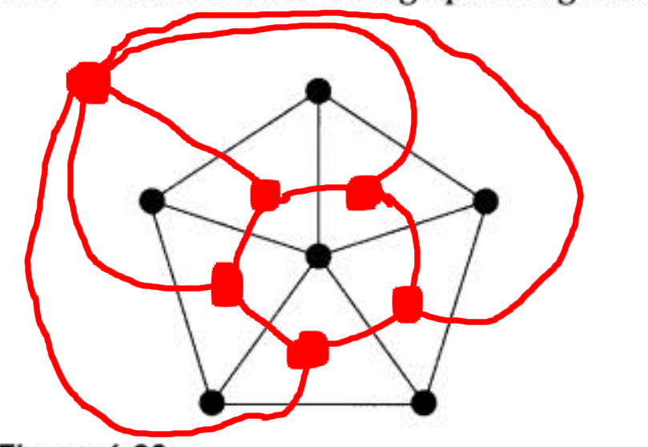
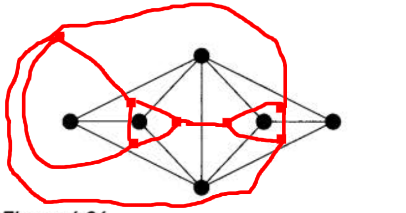
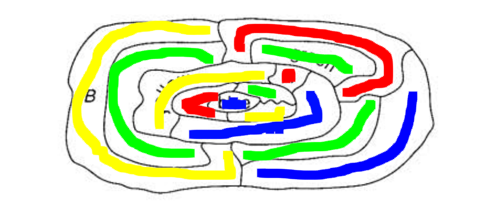

# HW6
## Chapter 4
  - 22.  
      >  
      >  $n^*=f=f*=n=6, m*=m=10$
  - 23.  
      >  
      >  $n^*=f=7, f*=n=6, m*=m=11$
  - 24. 
        Because we place them in 3D, they can inscribed with each other with each vertex of the inner one lies on different surface once and exactly once. Both of them have same m and $n^*=f, f*=n$. tetrahedron has $f=n=4,m=6$, so its dual graph is itself.
  - 25. 
        A wheel graph is isomorphic to a pyramid. If we roll a n-sides pyramid $\pi$ along x axis and rotate it $\frac{2\pi}{n}$ along y axis and scale it properly, then it should inscribed with itself with each vertex of the inner one lies on different surface once and exactly once. The wheel or say the pyramid is self-dual.
## Chapter 5
  - 1.  
        1. 2, it is a bipartite graph
        2. 4, it has a subgraph $K_4$ so it is impossible to color it with less than 4 colors. It is a planar graph so it must be able to colored by 4 or less colors. Thus 4.
  - 4.  
        1. tetrahedron 4($K_4$), cube 2($bipartite$), octahedron 3, icosahedron 4($W_6$), dodecahedron 3.
        2. 3 colors for r, s, t seperately.
  - 7. 
        The original formula can be written as $X(G)(n-d)\geq n$. A graph with (n-d) nodes is equal to a graph $G'$ with a vertex x and all other vertices that have no shared edge with x. Because the vertices that share edges with x must be color by a different color, the number of nodes colored by the same color $X(G)$ is bounded by (n-d). Thus $X(G)(n-d)\geq n$.
  - 8.  
        1. $n-m+f=2, sum(bdy)=sum(deg)=2m$. Since it contains no triangle, $f\leq\frac{2m}{4}$. Conbine these together, we can get $4m-4n+8\leq 2m$, $4n\geq 2m+8$. If all degrees are at least 4, then $4n\leq 2m$, thus contradiction.
        2. Assuming the statement is true. Because $G$ contains a vertex v with at most 3 degrees. By removing v we can get graph $G'$. $G'$ is 4 colorable because of the statement. And we have 4 colors, so v must be able to be colored with the remaining color. Proved.
  - 19. 
        1. A cann't be yg because it is next to yg. If it is blue, then the one on the right of A must be r because it is next to bgy. Then three countries around the center blue cannot be colored b or r, and all of them must have different color, contradiction. A must be red.
        2. 
  - 21. a square
  - 22. The graph is devided by straight lines, then it must have even degree on each vertices and must be Eulerian graph. Thus it must be 2 colorable.
  - 24. 
        1&2. Dualize the graph, we can get -- By 4-17, there must be at least one vertex with degree less than or equal to 4. Assuming the statement is true, then the graph $G'$ by removing one vertex v with less than or equal to 4 degrees must be 4 colorable. If the neighbors of v use less than 4 colors, then it is 4 colorable. If they use all, then mark 4 vertices around v as $v_a, v_b, v_c$ and $v_d$ clockwise, and their color are a, b, c, d seperately. If there is not a path between $v_a$ and $v_c$ with nodes that only colored by a or c, then for any path from $v_a$ and only colored by a or c, reverse their color. Now v can be colored by a. If there is a path like that, then there must not be a path like that between b and d, do the same thing then the graph is 4 colorable.