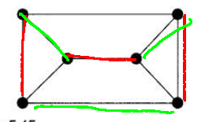

# HW7
## Chapter 5

 - 9. 
   - 1. $k(k-1)(k-2)(k-3)(k-4)(k-5)$ 7!
   - 2. $k(k-1)^5$ 7*6^5
 - 12. 
   - 1. $k(k-1)^5+k(k-1)(k-2)^5$
   - 2. $k(k-1)^4-(k(k-1)^3-k(k-1)(k-2))$
 - 25. 
 - 28. 
        |   Graph   | Lower | Upper | Actual |
        | :-------: | :---: | :---: | :----: |
        |   $C_5$   |   2   |   3   |   3    |
        |   $K_8$   |   7   |   8   |   7    |
        | $K_{4,6}$ |   6   |   7   |   6    |
 - 31. Degree = 3, Color>=3  
        Form a Hamiltonian path, color it with 2 colors(total vertices must be even(2m = sum(deg))), and the remaining with the 3rd color